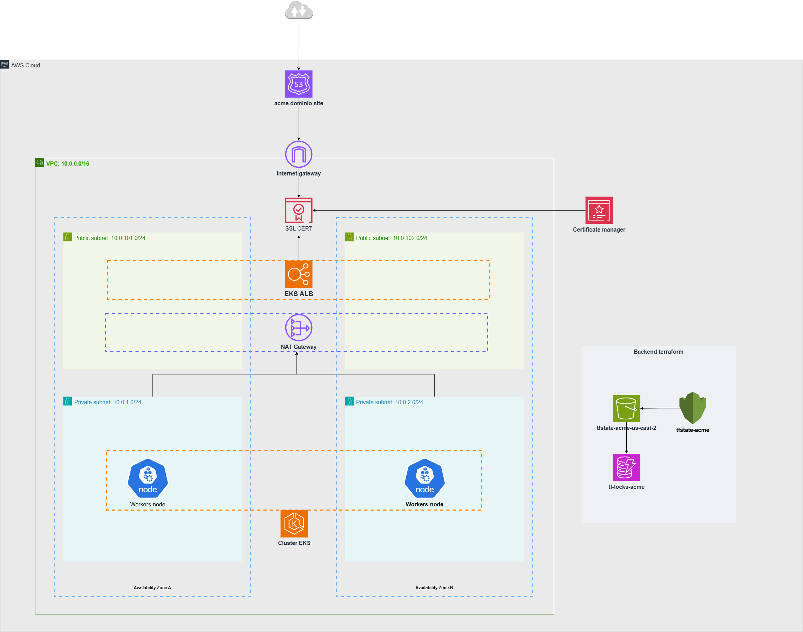

# ACME Infra Blueprint (AWS EKS)

## Arquitectura



> Diagrama de arquitectura completo en Draw.io:
> **https://drive.google.com/file/d/1UYNDwY2zpmiTulDiQZPCx0bFsTOCwO0N/view?usp=sharing**


Infra mínima para levantar:
- **Backend de Terraform** en AWS (S3 + DynamoDB + KMS).
- **Networking (VPC)** con subnets públicas/privadas etiquetadas para EKS.
- **EKS** con node group administrado.
- **AWS Load Balancer Controller (ALB)**.
- **Ejemplo k8s** (namespace, deployment, service, hpa and ingress).

Todo se orquesta con Make y se ejecuta dentro de un contenedor de Terraform (sin instalar Terraform local).

## Requisitos
- **Docker** instalado.
- **AWS CLI** configurado con un profile que tenga permisos para crear S3, DynamoDB, KMS, VPC, EKS, IAM, etc.
- Acceso al directorio de credenciales de AWS:
  - Windows: `C:\Users\<tu-usuario>\.aws`
  - Linux/Mac: `~/.aws` (puedes sobreescribir la ruta al ejecutar make)

## Variables útiles (Makefile)
- **OWNER**: dueño del stack. Default: `acme`.
- **ENV**: entorno. Default: `dev`.
- **REGION**: región AWS. Default: `us-east-2`.
- **AWS_PROFILE**: profile de AWS CLI. Default: `entrepenur`.
- **PATH_AWS_CREDENTIALS**: ruta a credenciales AWS. Default Windows.


## Estructura
- **terraform/backend**: bootstrap de S3 (state), DynamoDB (locks) y KMS.
- **terraform/modules**: módulos propios (vpc, eks, lb-controller).
- **terraform/stacks/dev**: stacks por capa (network/vpc, eks/cluster, eks/lb-controller).
- **makefiles**: targets para cada capa.
- **k8n/**: manifiestos de ejemplo (namespace, deployment, service, ingress).

## Quickstart

1) Construye la imagen de Terraform:
```bash
make build
```

2) Crea el backend remoto (S3 + DynamoDB + KMS):
```bash
make tf.backend.init
make tf.backend.apply
```
- S3 bucket: `tfstate-$(OWNER)-$(REGION)`
- DynamoDB: `tf-locks-$(OWNER)`
- KMS alias: `alias/tfstate-$(OWNER)-3`

3) Provisiona la VPC:
```bash
make tf-network.init
make tf-network.plan
make tf-network.apply
```
- Vars por defecto: `terraform/stacks/dev/network/vpc/vars/dev.tfvars`

4) Provisiona el clúster EKS:
```bash
make tf-eks.init
make tf-eks.plan
make tf-eks.apply
```
- `CLUSTER_NAME` se calcula como: `eks-$(OWNER)-$(ENV)-$(REGION)`

5) Instala el AWS Load Balancer Controller:
```bash
make tf-lb-controller.init
make tf-lb-controller.plan
make tf-lb-controller.apply
```

6) Configura kubectl (si aún no tienes kubeconfig):
```bash
aws eks update-kubeconfig \
  --name eks-$(OWNER)-$(ENV)-$(REGION) \
  --region $(REGION) \
  --profile $(AWS_PROFILE)
```

7) Despliega el ejemplo k8s:
```bash
kubectl apply -f k8n/namespace.yaml
kubectl apply -f k8n/deployment.yaml
kubectl apply -f k8n/service.yaml
# IMPORTANTE: edita k8n/ingress.yaml para tu dominio y ACM antes de aplicar
kubectl apply -f k8n/ingress.yaml
```

## Notas importantes
- **Credenciales en Docker**: si no monta bien las credenciales, ajusta `PATH_AWS_CREDENTIALS` y `AWS_PROFILE`.
- **Ingress**:
  - Actualiza `alb.ingress.kubernetes.io/certificate-arn` con tu ACM en la misma región del clúster.
  - Cambia `spec.rules[0].host` a tu dominio.
- **Help y shell**:
  - `make help` muestra targets disponibles.
  - `make shell` abre una bash dentro del contenedor de Terraform por si quieres ejecutar comandos manualmente.
- **Costos**: esto crea recursos con costo en AWS (EKS, subnets, etc.). No olvides destruir si es solo demo.

## Destrucción
Sigue el orden inverso:
```bash
make tf-lb-controller.destroy
make tf-eks.destroy
make tf-network.destroy
make tf.backend.destroy
```

## Troubleshooting rápido
- Si `terraform init/plan/apply` falla por auth: revisa `AWS_PROFILE` y `PATH_AWS_CREDENTIALS`.
- Si el Ingress no crea ALB: verifica que el LB Controller esté instalado y que el ARN de ACM sea válido y de la misma región.
- Si kubectl no conecta: vuelve a correr `aws eks update-kubeconfig ...` con el `--profile` correcto.

## Licencia
Uso libre como blueprint de referencia. Ajusta a tus estándares para producción.
